# Predicting Histone Modifications from DNA Sequence

A multi-label deep learning project that takes a short stretch of DNA as input and predicts, simultaneously, whether each of ten different chemical "tags" sits on that region of the genome.

Four different model architectures (CNN, CNN+BiLSTM, Transformer encoder, supervised CNN-VAE) are trained on the same multi-label problem and compared head-to-head on validation and test data.

----

## Table of Contents

1. [What the project does](#1-what-the-project-does-plain-english)
2. [Why it matters — applications](#2-why-it-matters--applications)
3. [Problem statement](#3-problem-statement)
4. [Assumptions and hypotheses](#4-assumptions-and-hypotheses-about-the-data-and-models)
5. [Exploratory data analysis](#5-exploratory-data-analysis)
6. [Feature engineering and data transformations](#6-feature-engineering-and-data-transformations)
7. [Proposed approaches (models)](#7-proposed-approaches-models)
8. [Model selection](#8-proposed-solution-model-selection)
9. [Results and learnings](#9-results-and-learnings)
10. [Future work](#10-future-work)
11. [How to run](#11-how-to-run)
12. [Repository structure](#12-repository-structure)

---

## 1. What the project does

**DNA is a long string written in a 4-letter alphabet.** Every one of your cells carries about three billion characters of it, written using only the letters `A`, `C`, `G`, and `T`. The order of these letters encodes the recipes for proteins and the instructions for when each protein gets made.

**But DNA does not run on its own, it is wrapped around protein spools called histones.** Imagine a 6-foot-long string of beads stuffed inside a marble. To fit, the string is wound tightly around little spools. Whether the cell can actually 'read' a given stretch of DNA depends on whether that part of the string is loosely or tightly wound around its spools.

**Cells leave little chemical sticky notes on these spools** to mark which parts of the DNA are open for reading, which are silenced, which are gene starts, and so on. These sticky notes are called **histone modifications**. Each kind of sticky note has a name like `H3K4me3`, `H3K9ac`, `H4ac`, and so on. Different sticky notes mean different things:

| Sticky note | What it usually means |
|---|---|
| `H3K4me3` | "this is the start of an active gene" |
| `H3K4me1` | "this is a distant gene control switch (enhancer)" |
| `H3K9ac`, `H3K14ac`, `H4ac` | "this region is open and can be read" |
| `H3K36me3` | "the gene here is being actively read right now" |
| `H3K79me3` | "transcription is happening here" |
| `H3`, `H4` | "there is a histone here at all" |

Measuring where these sticky notes sit is done with an expensive lab technique called ChIP-seq. **This project asks:** can a deep learning model look at *only the DNA letters* in a 500-character window and predict, for all 10 sticky notes at once, which ones are present?

A working model means we can replace expensive lab experiments with a cheap forward pass through a neural network, and predict the effect of a single-letter DNA change on which sticky notes will appear.

---

## 2. Why it matters — applications

- **Cheap genome annotation.** Lab experiments to map histone modifications cost tens of thousands of dollars per cell type. A model that predicts them from sequence alone can annotate regions of the genome at near-zero cost.
- **Variant interpretation in disease genetics.** When a patient has a single-letter DNA mutation, doctors need to know whether it lands in a functionally important region. A model trained to predict histone marks can flag whether that single letter change would silence an active gene or destroy an enhancer.
- **Drug target discovery.** Many drugs work by changing which genes are active in a cell. Knowing which regulatory regions a small molecule disrupts helps researchers prioritize targets.
- **Cell-type identification from DNA accessibility.** Different cell types (neurons, muscle, immune cells) display different patterns of histone marks. Predicting marks from sequence is a building block for higher-level cell-type prediction tools.
- **Synthetic biology.** When designing artificial DNA constructs (gene therapies, engineered cells), researchers need to predict whether the construct will be read or silenced by the cell. Histone-mark prediction is part of that pipeline.

---

## 3. Problem statement

> **Given a 500-character DNA sequence, predict simultaneously which of ten histone modifications occupy that region.**
>
> The ten marks are: `H3`, `H4`, `H3K4me1`, `H3K4me2`, `H3K4me3`, `H3K9ac`, `H3K14ac`, `H3K36me3`, `H3K79me3`, `H4ac`.

This is a **multi-label classification** problem: a single sequence can carry zero, one, or many marks at once. The output of each model is a length-10 vector of probabilities, one per mark.

**Why multi-label instead of ten separate binary models?** Two reasons:
1. **Shared representations.** All ten marks read the same DNA. Features useful for predicting one mark are often useful for predicting another, so a single shared backbone is more data-efficient.
2. **One pass at inference.** A single forward pass produces all ten predictions, rather than ten separate model evaluations.

Data source: the [Nucleotide Transformer downstream tasks benchmark](https://huggingface.co/datasets/InstaDeepAI/nucleotide_transformer_downstream_tasks) (Dalla-Torre et al., 2024), `default` configuration. The benchmark provides each of the ten marks as a separate binary task, which we merge into a multi-label dataset using a per-mark observation mask.

---

## 4. Assumptions and hypotheses about the data and models

**Data assumptions**

- The 500 bp DNA sequence around a region contains enough information to predict its histone marks. (If it didn't, no model and no matter how big — could work.)
- Sequences in the train and test splits come from non-overlapping genomic regions, so a model cannot succeed by memorizing.
- Labels are partially observed: each sequence has known labels for only some of the ten marks (it appeared in only some of the ten underlying ChIP-seq experiments). We track this with a per-mark **mask** and ignore unobserved entries in both the loss and the metrics.

**Modeling hypotheses**

| Model | Hypothesis it tests |
|---|---|
| **1D CNN** | Local sequence motifs (short patterns like `TATAA` or `GGGCGG`) are most of the signal. A 1D convolution acts as a learnable motif detector. |
| **CNN + BiLSTM** | Local motifs matter *and* their relative position / spacing across the sequence matters. The CNN front-end finds motifs; the BiLSTM models how they interact across hundreds of base pairs. |
| **Transformer Encoder** | Long-range, attention-based interactions between any two positions in the sequence are necessary. The Transformer has no built-in notion of motifs. |
| **Supervised CNN-VAE** | Forcing the model to *also reconstruct* the input from a low-dimensional bottleneck encourages it to learn cleaner representations that generalize better. |

---

## 5. Exploratory data analysis

### Class balance per histone mark

Some marks are common (present on >40% of observed regions), others are rare (<15%). This is important for picking metrics: plain accuracy is misleading on imbalanced data, so we report AUROC, AUPRC, and F1 instead.

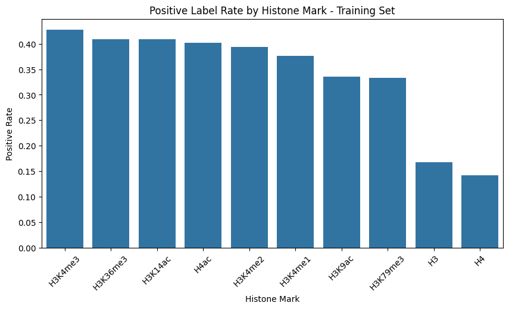

### Positive rate among observed labels only

When we exclude unobserved entries (using the mask), the positive rate within each mark's observed examples is much closer to 50%. This is because the underlying benchmark balances positives and negatives within each mark's individual dataset.

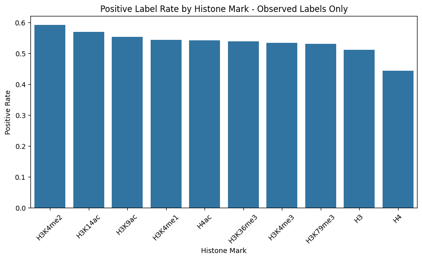

### Label coverage

Most sequences have between 5 and 7 of the 10 labels observed (out of 10 possible). Almost no sequence has all 10. **This is the most important fact about the dataset:** any honest evaluation must use the mask to ignore unobserved labels.

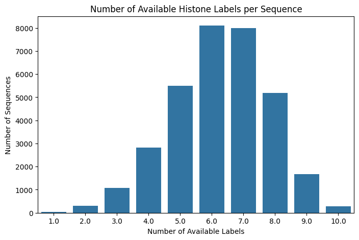

### Sequence length

Sequences are essentially all 500 base pairs long, with a small tail of shorter ones. We pad short sequences to 500 bp.

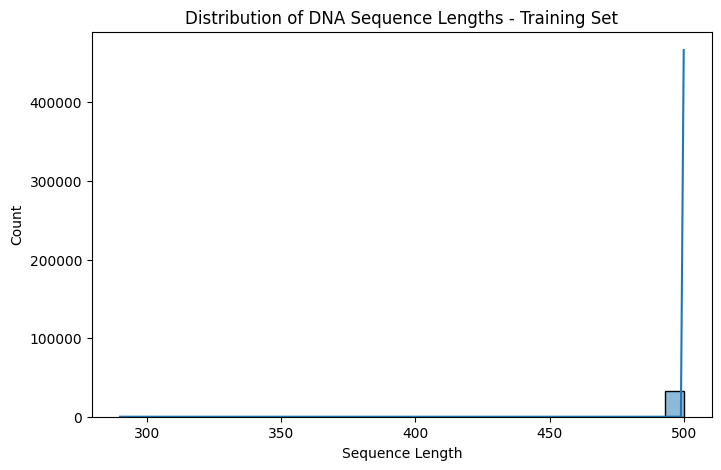

### Label correlation

Marks that mean similar biological things are strongly correlated, which is a useful sanity check. For example, the three "active gene start" marks `H3K4me3`, `H3K9ac`, `H3K14ac`, `H4ac` form a visible cluster of positive correlations (r ≈ 0.4–0.6). The "active transcription body" mark `H3K36me3` is negatively correlated with the gene-start marks, which matches biology — gene starts and gene bodies are mutually exclusive.

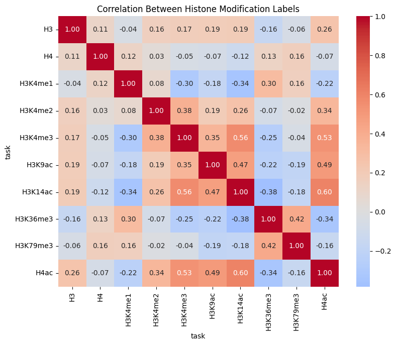

---

## 6. Feature engineering and data transformations

**Tokenization.** Each nucleotide is mapped to a small integer (`A→1`, `C→2`, `G→3`, `T→4`, `N→5`, with `0` reserved for padding). Sequences shorter than 500 bp are right-padded with the `N` token; longer ones are truncated. This produces input tensors of shape `(batch, 500)` that feed straight into a learned embedding layer.

**Label vector.** For every sequence, we build a length-10 binary vector with one slot per mark.

**Mask vector.** Alongside the label vector we keep a length-10 binary mask: `1` if that mark was observed for this sequence, `0` otherwise. This mask gets used in two places:

1. **Loss function.** A masked binary cross-entropy: contributions from unobserved entries are zeroed out before averaging.
2. **Metrics.** Every per-label metric (F1, AUROC, AUPRC, accuracy) is computed using only entries where the mask is `1`.

**No other feature engineering.** Each deep model learns its own representation from raw integer tokens. We deliberately avoid hand-crafted features (k-mer counts, GC content, etc.) so the comparison between architectures is fair.

**Train/val/test split.** The benchmark already separates train and test. We carve a 20% validation split out of training data using a fixed random seed (so the split is reproducible). Train: 33,020 sequences. Validation: 8,254. Test: 21,189.

---

## 7. Proposed approaches (models)

All four models share the same input pipeline (integer-tokenized 500 bp sequence) and the same output head (10 sigmoid units, one per mark). They differ in what sits in between.

### 7.1 1D CNN

A 3-layer convolutional network. The first conv layer's filters effectively become DNA motif detectors. Max-pooling collapses the sequence, then a small dense head produces 10 logits.

### 7.2 CNN + BiLSTM (DanQ-style)

A single conv layer extracts local motifs, then a bidirectional LSTM reads across the convolved feature map from left to right and right to left. The recurrence is meant to capture how motifs at different positions interact.

### 7.3 Transformer Encoder

A small Transformer encoder (2 layers, 128-dim, 4 heads) with sinusoidal positional encoding. Self-attention models long-range interactions between every pair of positions.

### 7.4 Supervised CNN-VAE

A CNN encoder produces a 64-dim latent vector. A classifier head reads the latent and predicts the 10 marks. A decoder reconstructs the input from the latent. The training objective combines classification BCE + reconstruction CE + a small KL regularizer (β = 0.001). The motivation is that forcing the latent to reconstruct should encourage generalizable representations.

### Overfitting / underfitting checks

Each model is trained for up to 20 epochs with early stopping. Train loss and validation AUROC are tracked per epoch — divergence between train and val signals overfitting, while flat curves signal underfitting.

#### 1D CNN

Train loss keeps decreasing, but val loss starts climbing around epoch 10 (classic overfitting). Early stopping triggered at epoch 20.

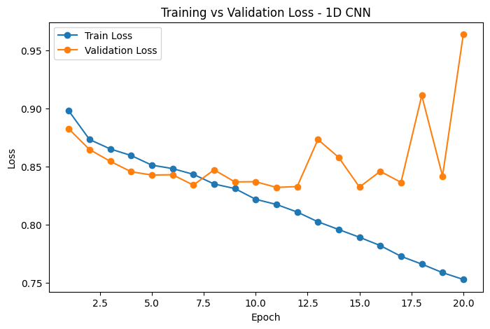
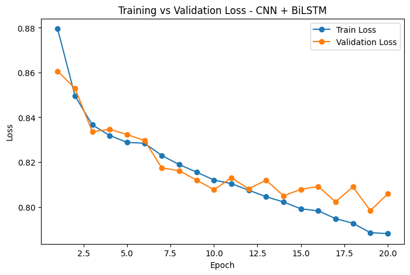

#### CNN + BiLSTM

The cleanest curve of the four: train and val loss decrease together for the full 20 epochs, and val AUROC keeps improving. This model is well-matched to the dataset size.

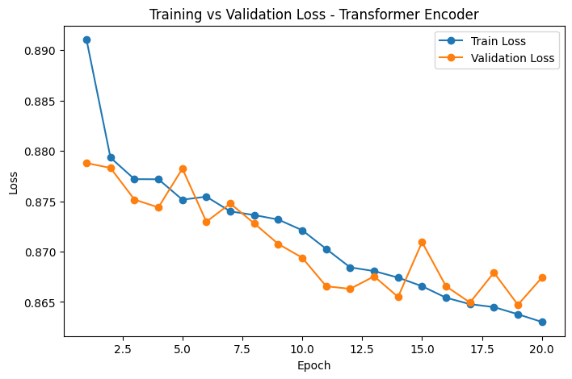
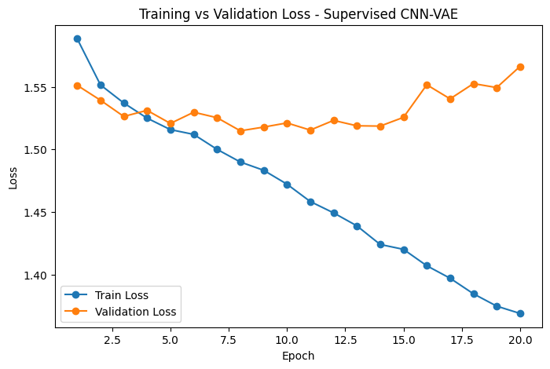

#### Transformer Encoder

Severe underfitting. Train and val loss plateau early, and val AUROC stalls around 0.64 which is well below the other three architectures. A randomly-initialized Transformer this small, without pretraining, simply doesn't have enough inductive bias for the task.

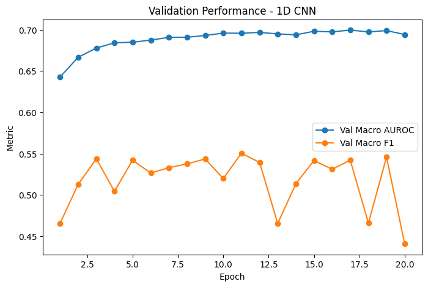
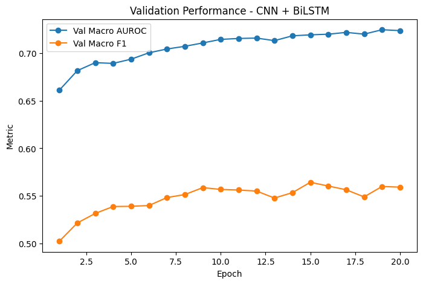

#### Supervised CNN-VAE

Healthy training curves; the reconstruction term keeps the latent representation regularized. Val AUROC climbs steadily.

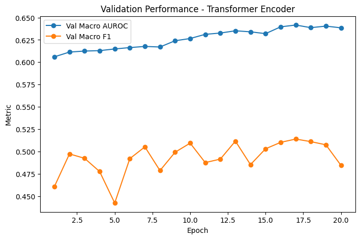
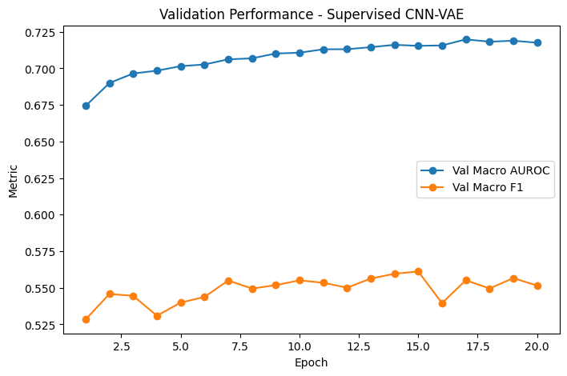

---

## 8. Proposed solution (model selection)

**Selection criterion:** validation macro AUROC. Macro AUROC averages each mark's AUROC equally, so that it's not biased toward the more common marks. It's also threshold-free, which matters because thresholds are tuned downstream.

| Rank | Model | Val macro AUROC | Val macro F1 |
|---|---|---|---|
| 1 | **CNN + BiLSTM** | **0.7248** | **0.5599** |
| 2 | Supervised CNN-VAE | 0.7170 | 0.5491 |
| 3 | 1D CNN | 0.6996 | 0.5421 |
| 4 | Transformer Encoder | 0.6421 | 0.5108 |

**Winner: CNN + BiLSTM.**

**Regularization that was applied:**
- Dropout (0.2–0.3) after convolutional and dense layers.
- Batch normalization after each conv layer (1D CNN and VAE).
- Weight decay in AdamW (1e-4 to 1e-5 depending on model).
- Early stopping on validation loss.
- The VAE additionally uses a KL divergence term.

---

## 9. Results and learnings

### A bug that hid the real picture

Initial test-set metrics looked catastrophic: macro F1 dropped from 0.56 on validation to 0.18 on test. **The cause was a subtle bug:** training correctly used the per-mark observation mask, but the original test evaluation treated unobserved labels as negatives. This deflated precision across the board.

After fixing the test evaluation to use the same mask, test metrics line up sensibly with validation:

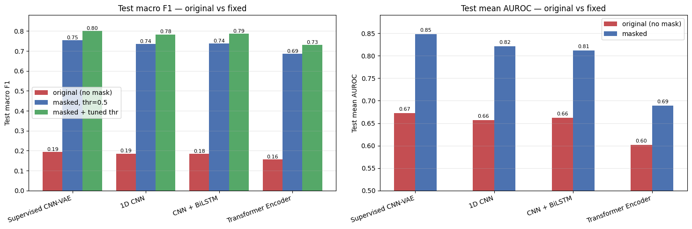

After the masking fix and per-label threshold tuning, the per-mark F1 picture across the four models is:

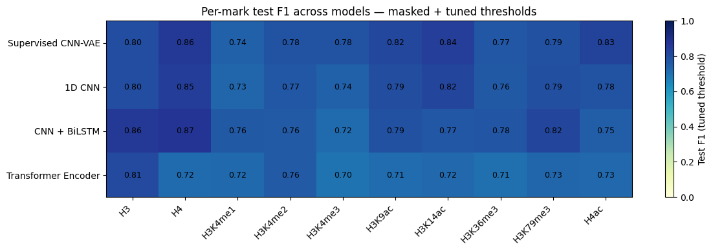

### Headline metrics (masked test set)

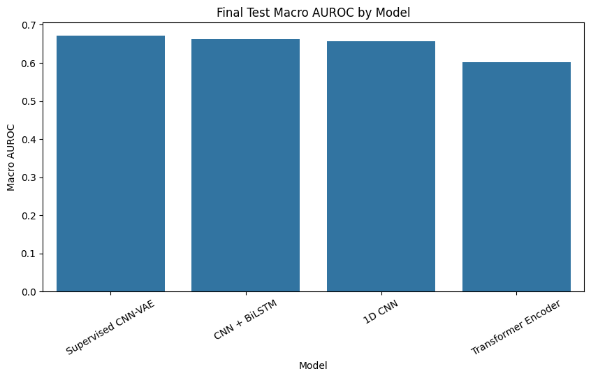
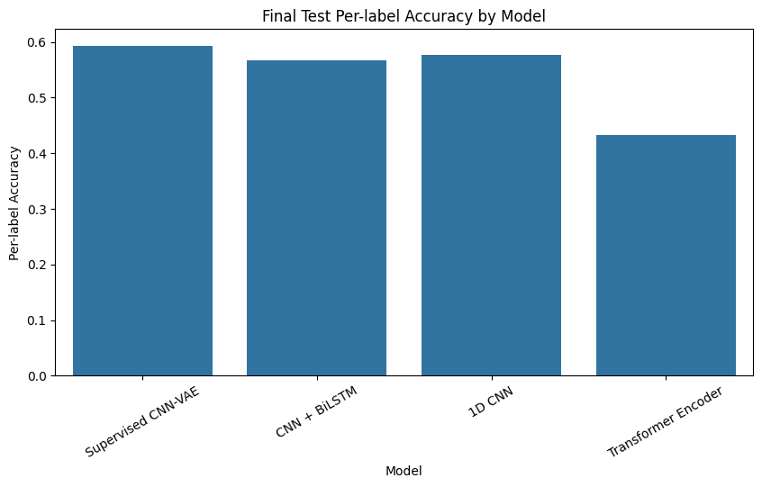

### Per-mark breakdown for the best model (CNN + BiLSTM)

Some marks are intrinsically much easier to predict from sequence than others. `H3` and `H4` (which just record histone occupancy) are the easiest; `H3K4me2` and `H3K4me3` (which require fine-grained discrimination among similar active-gene marks) are the hardest.

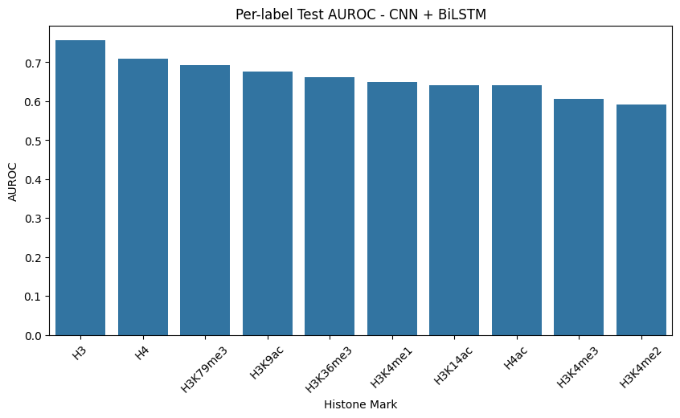
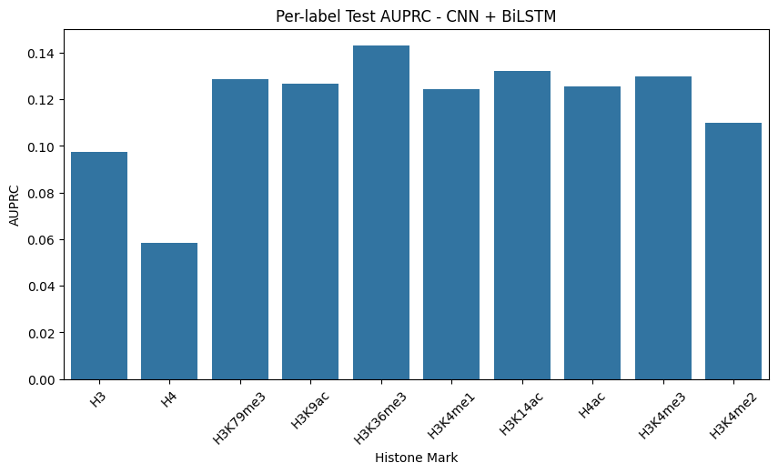

### Learnings from the methodology

- **Masking matters end-to-end.** Any evaluation step that doesn't use the per-mark mask produces misleading numbers. This is the single most important methodological point of the project.
- **Inductive bias beats raw capacity on this dataset.** The CNN+BiLSTM has fewer parameters than the Transformer encoder but outperforms it by 0.08 AUROC. With only ~33k training sequences, a randomly-initialized Transformer simply can't learn what motif-finding convolutions provide for free.
- **A VAE side-objective is a wash.** The supervised CNN-VAE matches the plain CNN's classification performance, the reconstruction term doesn't help here, though it doesn't hurt either. The latent representation it learns might still be useful for downstream tasks (clustering, anomaly detection).
- **Per-label thresholds are worth tuning.** The default `0.5` threshold is mis-calibrated when the underlying class balance varies across labels. Tuning per-mark thresholds on the validation set added several points of macro F1 on the test set with zero extra training.
- **Some marks are intrinsically easier.** Histone-occupancy marks (`H3`, `H4`) score AUROC ≈ 0.75 while fine-grained active-mark distinctions (`H3K4me2` vs `H3K4me3`) hover near AUROC ≈ 0.6. This is consistent with the biology: occupancy is broadly correlated with sequence composition, while fine-grained modifications depend on cell-type context that the sequence alone doesn't capture.

---

## 10. Future work

- **Bigger pretraining.** The Transformer underperformed because it was trained from scratch on ~33k sequences. Pretraining it on the human reference genome (e.g., as a masked language model like DNABERT) before fine-tuning should close the gap with the CNN+BiLSTM and likely beat it.
- **Longer sequence context.** Histone marks are influenced by sequence well beyond 500 bp. A model that ingests 2–5 kb of context (using dilated convolutions or sparse attention) is likely to push AUROC meaningfully higher.
- **Cell-type-specific predictions.** The current benchmark mixes cell types. A model that conditions on cell type as an auxiliary input would more faithfully reflect biology, where the same DNA carries different marks in different cell types.
- **Scale up to DeepSEA / Basenji style.** This project predicted 10 marks; the canonical regulatory-genomics benchmarks (DeepSEA: 919 features, Basenji: 4,000+) predict orders of magnitude more. The masked-BCE scaffolding here generalizes directly.
- **Interpretability.** Visualizing learned conv filters (saliency maps, TF-MoDISco) would let us check whether the CNN is rediscovering known biological motifs.
- **Ensemble.** Averaging probabilities from the four trained models almost always beats any single one. A weighted ensemble using the validation AUROC of each model is a simple, free win.

---

## 11. How to run

### Requirements

```bash
pip install torch numpy pandas datasets transformers scikit-learn seaborn matplotlib tqdm
```

A CUDA-capable GPU is recommended. On a Colab T4, end-to-end training of all four models takes about 25 minutes.

### Run the notebook

Open `notebook.ipynb` (the multi-label notebook) in Jupyter or Colab and run all cells in order. The notebook is self-contained: it downloads the InstaDeepAI dataset, trains the four models, and produces every figure in `results/`.

### Reproduce the test-metric fix only

If you already trained the models and just want to fix the masking bug in the test metrics, paste the contents of `patch_masked_test_metrics.py` as the final cell of the notebook and run it.

---

## 12. Repository structure

```
.
├── README.md                            # this file
├── notebook.ipynb                       # main notebook (4 models, end-to-end)
├── patch_masked_test_metrics.py         # masking fix + per-label threshold tuning
├── results/                             # figures used in this README
│   ├── 02_sequence_length_distribution.png
│   ├── 03_label_balance.png
│   ├── 04_labels_per_sequence.png
│   ├── 05_observed_only_positive_rate.png
│   ├── 06_label_correlation_heatmap.png
│   ├── 07_training_curves_cnn_loss.png
│   ├── 08_training_curves_cnn_auroc.png
│   ├── 09_training_curves_bilstm_loss.png
│   ├── 10_training_curves_bilstm_auroc.png
│   ├── 11_training_curves_transformer_loss.png
│   ├── 12_training_curves_transformer_auroc.png
│   ├── 13_training_curves_vae_loss.png
│   ├── 14_training_curves_vae_auroc.png
│   ├── 15_model_comparison_auroc.png
│   ├── 16_model_comparison_f1.png
│   ├── 17_model_comparison_loss.png
│   ├── 18_per_label_auroc_best.png
│   ├── 19_per_label_auprc_best.png
│   ├── 20_confusion_matrix_counts.png
│   ├── 21_patch_original_vs_fixed.png
│   └── 22_patch_per_mark_f1_heatmap.png
└── histone_project_outputs/             # saved CSVs from notebook runs
    ├── validation_results.csv
    └── test_results.csv
```

---

## Acknowledgements

- Dataset: [InstaDeepAI Nucleotide Transformer downstream tasks](https://huggingface.co/datasets/InstaDeepAI/nucleotide_transformer_downstream_tasks) (Dalla-Torre et al., 2024).
- Architectures inspired by DeepBind/Basset (Alipanahi et al., 2015; Kelley et al., 2016), DanQ (Quang & Xie, 2016), and standard Transformer-encoder designs.
